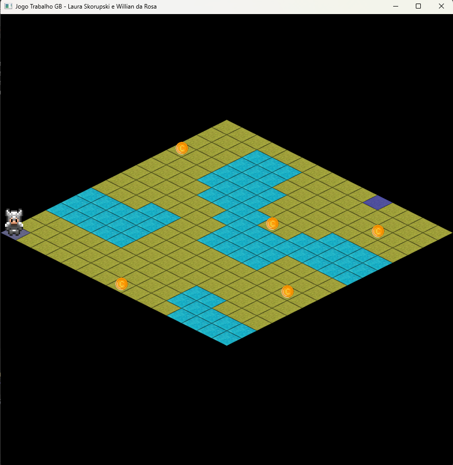

### Jogo com Visão Isométrica - Laura Skorupski e Willian da Rosa

1. **O que Esse Projeto Realiza?**
    - Este projeto tem como objetivo aplicar os conhecimentos aprendidos durante a disciplina de Pocessamento Gráfico através de um jogo com vião isométrica.
    - Ao executá-lo, ele deverá abrir a seguinte tela:
  
     

2. **Instruções**
     - Para ganhar o jogo, faça o cavaleiro coletar todas as moedas e chegar ao destino final sem cair na água ou sair do mapa.
       
3. **Comandos**
     - Seta para cima: Norte
     - Seta para baixo: Sul
     - Seta para direita: Leste
     - Seta para a esquerda: Oeste
     - Shift + seta para cima: Noroeste
     - Shift + seta para baixo: Sudoeste
     - Ctrl + seta para cima: Nordeste
     - Ctrl + seta para baixo: Sudeste
     - Espaço: Reiniciar Jogo
     - Esc: Sair

4. **Configuração do Ambiente**:
    - Para rodar o projeto é necessário adicionar as bibliotecas utilizadas por ele (disponíveis na pasta Dependencies).
